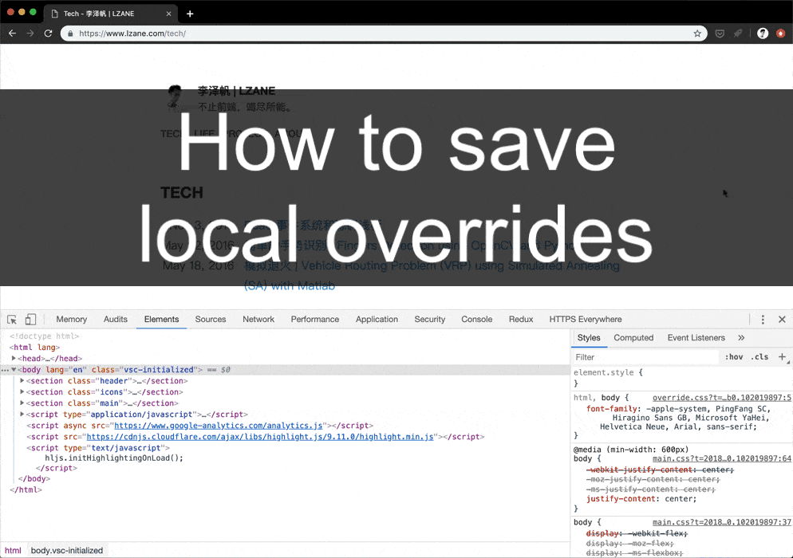

# 3. 固化变更代码覆盖，一个尝试点子的好技巧 

## 问题

?> 在开发过程中，我们经常需要临时尝试一些点子。比如说设计师突然想替换一个入场动画背景颜色或替换一张图片；尝试刚刚想到的一个可以提高前端性能的方案；亦或是在你喜欢的页面里加上自己的自动化js脚本等。

总之不管是样式，JS，还是直接更改HTML，都会发现这是个非常有用的技巧。在知道这个技巧之前，每一次做样式或者尝试都很担心不小心按到刷新，因为一刷新所有在DevTools的变更就会没了😂。

## 答案

> - 在 `Sources 面板` 下面左侧找到 `Overrides 标签页`
> - 点击 `Select folder for overrides` 选择一个文件夹用以储存变更
> - 在弹出的权限提示框中点击‘允许’
> - 现在在 `Elements面板` 中直接修改样式，DevTools 会自动生成一个文件储存这些变更
> - 在 `Network面板` 下右键你想更改的文件，点击 `save for overrides` ，你就可以更改这个文件了，并且所有变更在刷新之后仍然有效

