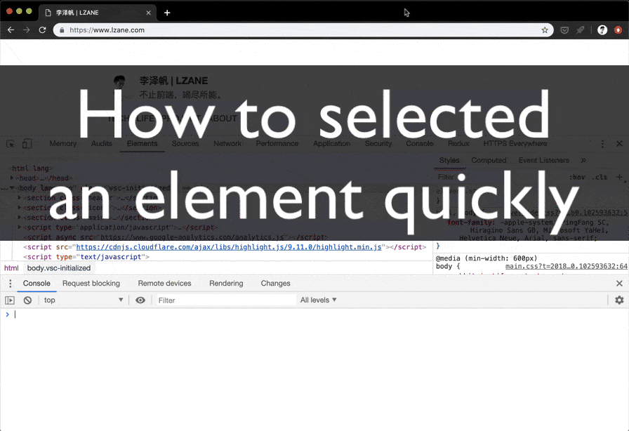

# 4. 如何快速选取一个元素

## 问题

?> 不管我们做元素样式的审查，还是需要操作 DOM 结点上面的 js 属性，我们都需要选择一个元素。怎样才能快速的选择一个元素成为提高效率的重要一环。

因为经常看到有同学在DevTools里面手打 `document.selectEle...`。

## 答案

> - 直接在Console里面使用 `$` 替代 `document.querySelector()`。
> - 使用审查工具直接点击一个元素，接着直接使用 `$0` 访问。
> - DevTools甚至储存了你历史审查过的元素，可以用 `$0,$1,$2,$3`来访问。

