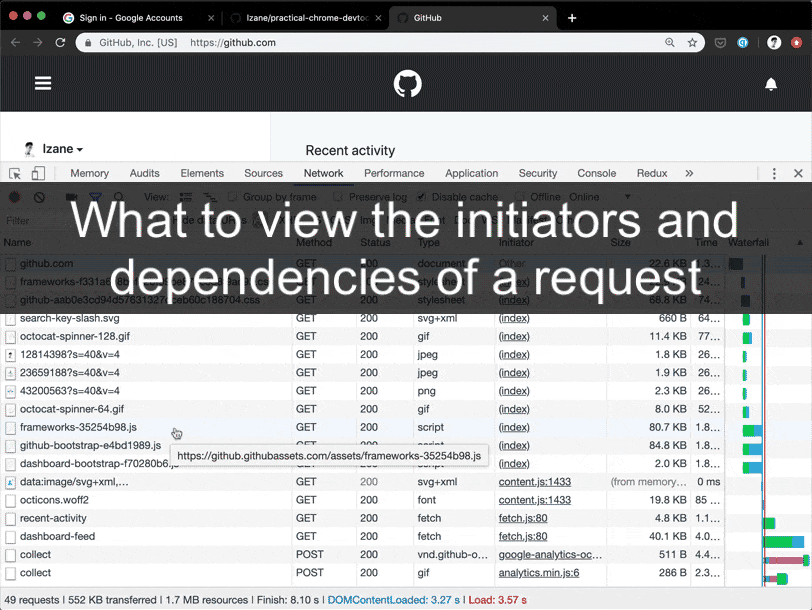

# 2. view the initiators and dependencies of a request

## Question

?> We often need to view the initiators and dependencies of a request.

This is practical for performance optimization and viewing the context of a request. I often use it for visualizing and debugging the result after code splitting.

## Answer

> - Hole down `Shift` and hover over the request.
> - The initiators were colored by green, and the dependencies (what the request trigger next) by red.

