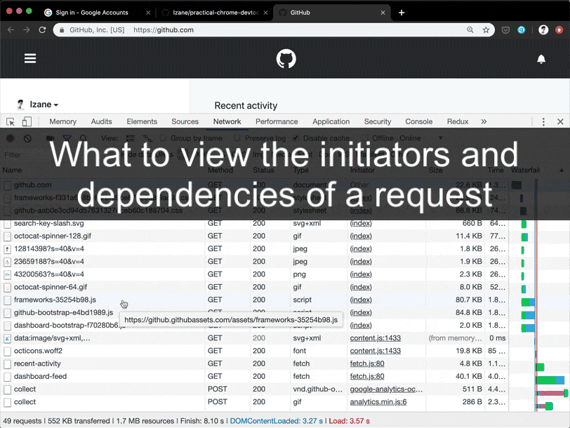

# 查看一个请求由谁触发，接着触发了哪些请求

## 问题

?> 经常我们想知道一个请求是由谁触发的，然后这个请求又接着触发了哪些请求。

这在性能优化，查看一个请求的上下文关系等均很实用。我自己经常用它来调试代码分拆后的资源加载的结果，并提供了一个很好的可视化。

## 答案

> - 按住`Shift`， 将鼠标移到想要查看的请求上面
> - 绿色显示这个请求由谁触发，红色显示这个请求接着触发了哪些请求。

